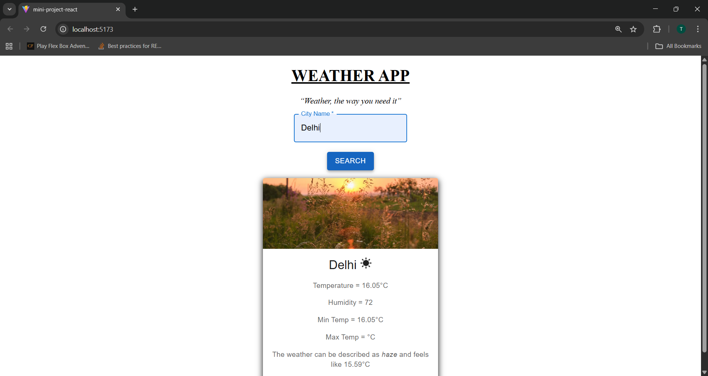
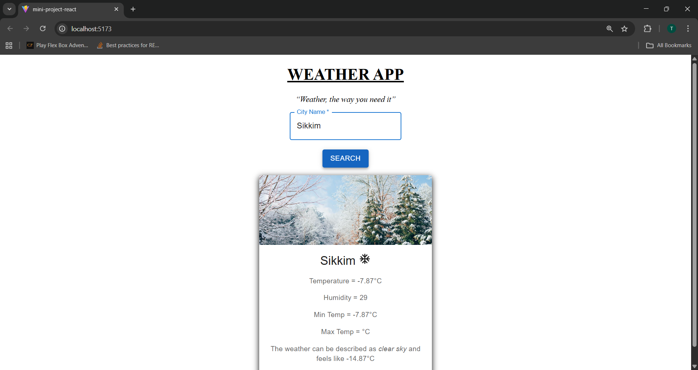
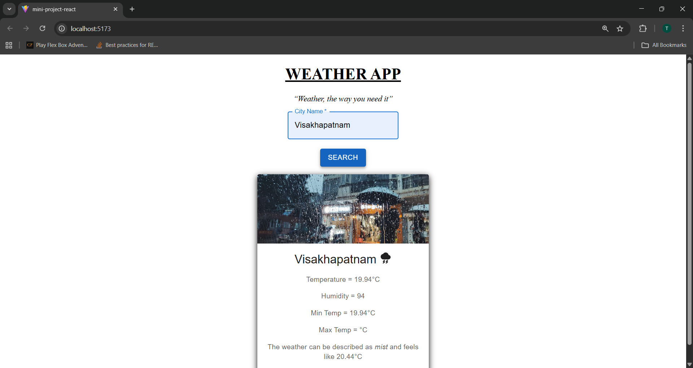

# 🌦️ Weather App (React + Material UI)

A responsive **Weather Application** built using **React** and **Material UI** that fetches real-time weather data from the **OpenWeatherMap API**.  
The app dynamically updates weather details, images, and icons based on temperature and humidity.

---

## ✨ Features

- 🔍 Search weather by **city name**
- 🌡️ Displays:
  - Current temperature
  - Minimum & maximum temperature
  - Humidity
  - Weather description
  - “Feels like” temperature
- 🖼️ Dynamic background images based on weather conditions
- 🌤️ Weather-based icons (Sunny / Cold / Rainy)
- ⚠️ Error handling for invalid city names
- 🎨 UI using **Material UI**

---

## 🛠️ Tech Stack

- **Frontend:** React (Vite)
- **UI Library:** Material UI (MUI)
- **API:** OpenWeatherMap API
- **Styling:** CSS
- **Icons:** MUI Icons

---

## 📁 Project Structure

src/
├── App.jsx
├── WeatherApp.jsx
├── Searchbox.jsx
├── InfoBox.jsx
├── Searchbox.css
├── InfoBox.css
└── main.jsx

---

## 🔑 Environment Variables

Create a `.env` file in the root directory and add:

env
VITE_API_KEY=your_openweathermap_api_key

---

## 🚀 How to Run the Project

1.Clone the repository

git clone https://github.com/your-username/weather-app.git

2.Navigate to the project folder

cd weather-app

3.Install dependencies

npm install

4.Start the development server

npm run dev

5.Open in browser:

http://localhost:5173

---

##🧠 Weather Image & Icon Logic

⛈️ Rainy: Humidity > 80%

☀️ Hot: Temperature > 14°C

❄️ Cold: Temperature ≤ 14°C

Images and icons update automatically based on these conditions.

---

## 📸 Screenshots

### 🏠 Hot Weather Result

### 🔍 Cool Weather Result

### ⛈️ Rainy Weather Result

---

## 🙌 Acknowledgements

OpenWeatherMap API

Material UI

Unsplash for weather images

---

💙 Author
- Sagarika 
